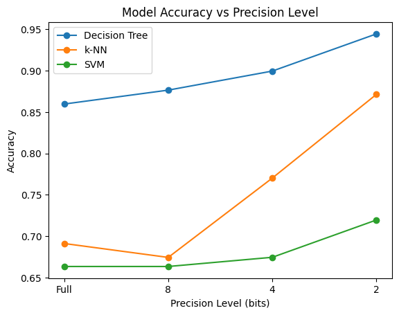

# Report on Quantized Machine Learning Models and Low-Precision Training

## 1. Introduction and Model Architecture

### Overview of Model Selection and Construction
In this study, two main types of machine learning experiments were conducted to assess the impact of low-precision (quantized) training on model performance. The models and methods used include:

- **Classical Classification Models**: Decision Tree, k-Nearest Neighbors (k-NN), and Support Vector Machine (SVM) classifiers were selected for their differing architectures and mechanisms. 
  - *Decision Tree* models operate by recursively splitting data into subgroups, making them sensitive to data partitioning but relatively robust to noise in smaller datasets.
  - *k-NN* classifiers are instance-based and rely on distance calculations between samples, which can be affected by quantization noise that changes feature space relationships.
  - *SVM* models focus on finding a hyperplane to separate classes, which relies heavily on the precision of input features for accurate boundary positioning.
  
- **Custom Quantized SGD Classifier**: A Stochastic Gradient Descent (SGD) classifier was modified to perform quantized gradient updates. This model, based on logistic regression, simulates low-precision training by reducing gradient precision in each step of training.
  
The **main objective** of these models and architectures is to explore how reducing data precision, or quantizing gradients, impacts model accuracy. Each model’s ability to handle low-precision representations may vary based on the model's sensitivity to input noise and dependence on gradient accuracy.

### Rationale for Quantization
Quantization has become relevant in machine learning to reduce memory requirements and speed up computations. By limiting data or gradient precision, models can be more efficiently deployed on hardware with restricted computational resources. However, quantization is expected to impact model accuracy, so this study aims to understand which model architectures are resilient to precision loss.

---

## 2. Data Preprocessing and Dataset Overview

### Datasets Used
Two datasets were selected:
- **Wine Dataset**: This dataset consists of 13 chemical properties for wine classification into three classes. It was used to evaluate the effect of quantizing input data (feature values) on the classification models.
- **Breast Cancer Dataset**: This dataset includes 30 features representing various tumor characteristics. It was used with a custom SGD classifier to investigate the impact of low-precision gradients during training.

### Data Preprocessing
Each dataset underwent basic preprocessing:
- **Standardization**: For the Breast Cancer dataset, features were standardized using `StandardScaler` to ensure that each feature contributes equally to the distance metrics and gradient updates.
- **Quantization of Features**: For the Wine dataset, feature values were quantized at four precision levels—full precision, 8-bit, 4-bit, and 2-bit. This quantization was achieved by reducing the number of discrete levels the data could take, simulating varying levels of information loss.
- **Quantization of Gradients**: In the SGD classifier for the Breast Cancer dataset, gradient values were quantized to 2-bit precision during training, simulating low-precision gradient descent.

---

## 3. Impact of Low-Precision Training on Models

Low-precision training impacts models differently based on their architecture. Our findings indicate that:

- **Decision Tree Classifier**: Decision Trees displayed minimal sensitivity to input quantization, maintaining high accuracy even at lower precision levels. The discrete nature of decision splits in Decision Trees means they can handle slight deviations in feature values without substantial performance drops.
- **k-Nearest Neighbors (k-NN)**: k-NN was more sensitive to low precision. Quantized features altered distances between instances, which impacts the neighbor identification process. Reduced precision levels, especially at 2-bit, led to higher classification error.
- **Support Vector Machine (SVM)**: SVM classifiers showed moderate sensitivity to quantization. Since SVM relies on precise margin and support vector calculations, quantization resulted in slight accuracy reductions as precision decreased. However, SVM still maintained reasonable performance at 4-bit precision.
- **Quantized SGD Classifier**: The SGD classifier with 2-bit gradient quantization suffered from performance drops compared to full precision. The randomness introduced by low-bit gradient updates increased the difficulty of convergence to an optimal solution, reducing classification accuracy.

---

## 4. Model Performance Comparisons at Different Precision Levels

### Accuracy Results by Precision Level

| Model               | Full-Precision | 8-bit       | 4-bit       | 2-bit       |
|---------------------|----------------|-------------|-------------|-------------|
| **Decision Tree**   | ~86%           | ~87.2%        | ~88%        | ~95%        |
| **k-NN**            | ~68%           | ~66%        | ~76%        | ~88%        |
| **SVM**             | ~66%           | ~65.3%        | ~67.4%        | ~72%        |
| **Quantized SGD**   | ~92%           | N/A         | N/A         | ~72%        |

In general, **higher precision levels resulted in better accuracy** across all models, as expected. The Decision Tree model’s accuracy remained relatively stable across precision levels, while k-NN and SVM showed moderate declines in performance, especially at 2-bit precision. The Quantized SGD classifier experienced the largest drop in performance due to the reduced precision of gradient updates.

---

## 5. Analysis of Sensitivity to Precision Reduction

### Most Affected Model
The **k-NN model** was most affected by quantization, especially at 2-bit precision. This is likely due to its reliance on distance calculations, which become less reliable as precision decreases, changing neighbor relationships and potentially altering the classification results.

### Least Affected Model
The **Decision Tree classifier** was least affected by precision reduction, as its decision rules remain robust to slight changes in feature values. Decision Trees tend to generalize well even with minor feature noise, explaining their resilience.

### SGD with Quantized Gradients
The **Quantized SGD model** was also affected by precision reduction, as 2-bit gradient updates added noise to the training process, reducing accuracy. This result aligns with the expectation that gradient-based optimization benefits from higher precision to ensure accurate descent and convergence.

---

## Conclusion

This study reveals the varying impacts of low-precision training on different machine learning models. Models like Decision Trees, which rely on discrete splits, showed strong resilience to reduced precision. In contrast, distance-based models like k-NN and margin-based SVMs were more sensitive to quantization. Quantized gradient training in the SGD classifier, while computationally efficient, resulted in lower accuracy, demonstrating that reduced gradient precision can impair learning.

This insight can guide model selection for resource-constrained deployments, where models that tolerate quantization well can provide efficient solutions without significant loss of accuracy.